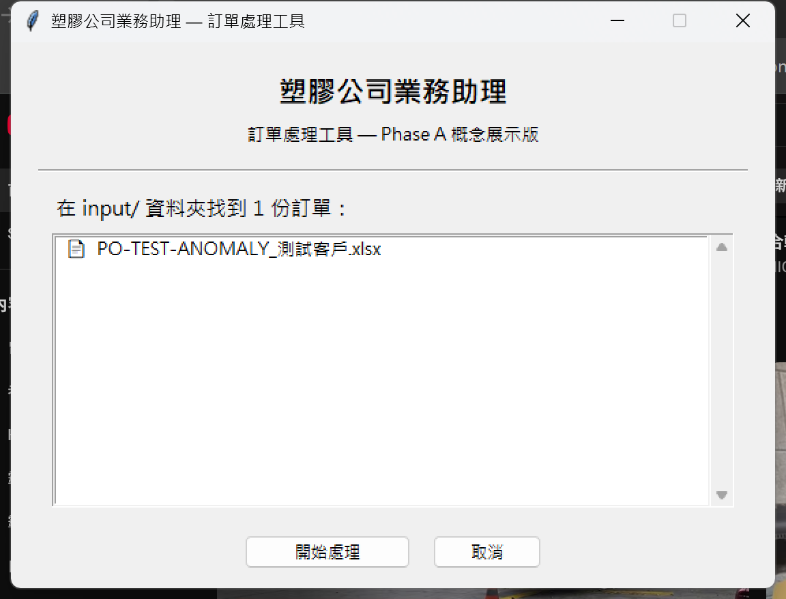
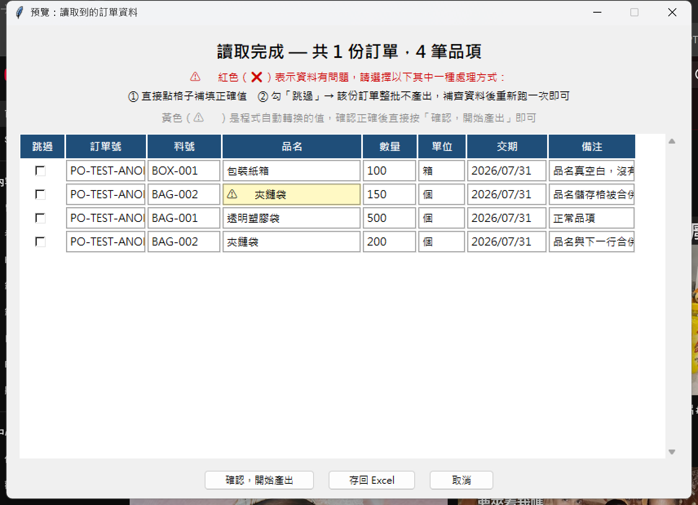
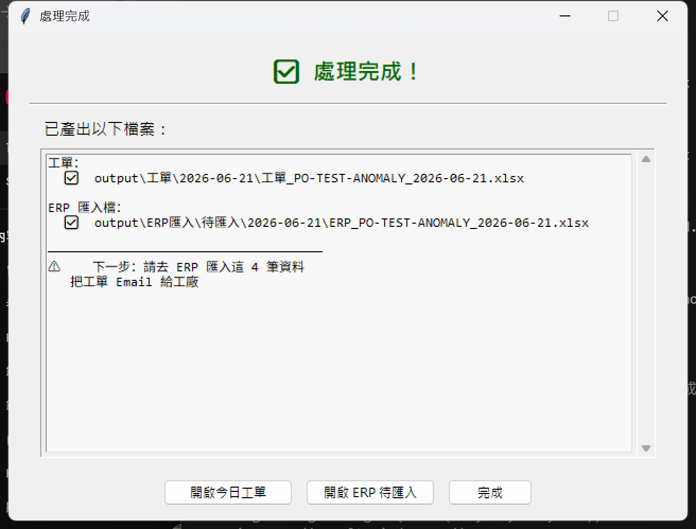

# 自動化規劃（初版 待確認）

## 一句話版

把朋友每天重複做的事——尤其是「同一份訂單資料手動打兩次」——用程式幫朋友自動完成，從最高效益的工單自動化開始做起。

> 核心原則（安全感優先）：程式只做準備，不會替朋友做決定。
> 所有自動判斷、資料轉換，或即將進入下一個環節，都會先讓朋友看到
> 發生了什麼、確認沒問題才繼續。

## 背景和動機

朋友每天處理 5–20 筆訂單，格式固定、來自老客戶。
最大痛點：收到客戶 Excel 訂單後，要手動重打進工單範本（給工廠），再打一次進公司 ERP。
同樣的資料每天打兩遍，是最浪費時間、也最容易出錯的地方。

---

## 問卷結果整理

根據問卷回覆，九項日常工作的自動化可行性評估如下：

| 工作項目 | 能自動化？ | 省時效益 | 說明 |
|---|---|---|---|
| ① 收訂單 | ✅ 可做-主線 | ★★ | 訂單存進固定資料夾＋按按鈕觸發，後續流程自動接手 |
| ② 輔助報價 | ⏸ 暫時不做 | ★ | 大多數客人是老客戶不需報價，效益有限 |
| **③ 製作工單** | **✅ 可做-主線** | **★★★★** | **本次重點，詳見下方** |
| **④ 登錄 ERP** | **✅ 可做-主線** | **★★★★** | **本次重點，ERP 支援批次匯入，詳見下方** |
| ⑤ 催交期 | ⚪ 待確認後再評估 | ★★ | 自動分階段提醒催貨，取代腦記 |
| ⑥ 確認出貨 | ⏸ 暫時不做 | — | ERP 直接出文件，本來就不需要額外處理 |
| ⑦ 訂單錯誤 | ⚪ 待確認後再評估 | ★ | Email 模板協助處理 |
| ⑧ 月底對帳 | ⏸ 暫時不做 | ★★ | 一個月只用一次，省時效益相對有限 |
| ⑨ 追蹤付款 | ⚪ 待確認後再評估 | ★★★ | 需先了解妳習慣紙本還是程式追蹤 |

---

## 本次重點：③ 製作工單 + ④ 登錄 ERP

這兩項合起來能真正解決「同一份資料打兩次」的問題，是目前效益最高、最值得優先做的部分。

```
客戶傳來的訂單 Excel
        │
        ▼
   放進固定的資料夾
        │
        ▼
    按一下桌面捷徑
        │
        ▼
  跳出確認視窗，妳檢查資料、按「確認」
        │
        ▼
   程式同時產出兩份檔案
        │
   ┌────┴────┐
   ▼         ▼
工單 Excel   ERP 匯入檔
   │         │
   ▼         ▼
寄給工廠   去 ERP 點一下匯入
```

### 怎麼運作（妳實際要做的事）

1. 把客戶傳來的訂單 Excel 放進固定的資料夾
2. 按一下桌面捷徑，程式開始讀取

   

3. 跳出一個確認視窗，顯示程式讀到的料號、數量、交期；格式有自動轉換的會標示黃色提醒，有問題的地方標示紅色，可以直接在視窗裡修改，或勾選跳過，看過沒問題再按「確認，開始產出」

   

4. 程式同時產出兩份檔案：工單 Excel（可直接用或寄給工廠）、ERP 批次匯入檔
5. 跳出結果視窗，一次看到產出的檔案，並提示下一步要去 ERP 匯入

   

6. 妳去 ERP 點一下匯入，不用再手動打第二次

> 以上是測試版程式的實際操作截圖（用假資料跑的），不是示意圖。等拿到妳的真實訂單範本和 ERP 匯入範本後，只要把欄位對應調整成符合真實格式，就可以直接上線使用。

### 預計成果

- 收到訂單 Excel → 一個動作 → 工單自動好 + ERP 匯入檔自動好
- 每天估計可省下 30 分鐘～1 小時（依訂單數量而定）
- 程式只負責「準備好」，最後匯入、確認都還是妳自己按，不會有東西在妳沒看過的情況下就送出

### 動工前需要的三份文件

| # | 文件 | 用途 |
|---|---|---|
| 1 | 客戶訂單 Excel 範本 | 讓程式知道從哪個欄位讀料號、數量、交期（假資料遮掉即可） |
| 2 | 工單 Excel 範本 | 讓程式知道要填進哪些格子（假資料遮掉即可） |
| 3 | ERP 批次匯入範本 | 讓程式產出 ERP 看得懂的格式（ERP 匯入介面點「下載範本」即可拿到） |

拿到這三份後，③④ 就可以直接開始，沒有其他卡點。
